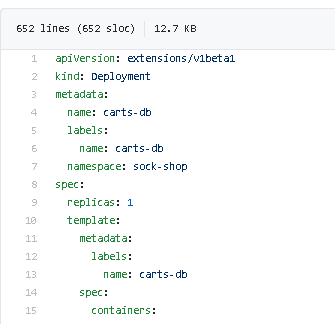
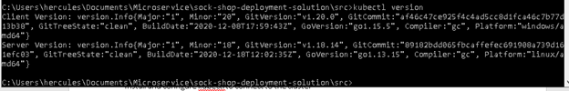
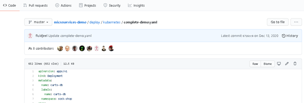

# DevOps Test Project

## Requirement overview

We deploy our microservices based architecture using Docker images on Kubernetes. As part of running this software we need to know what version of each service is running on each of our clusters. A review of the tools on the market found that nothing met the requirements we had and so we started to build something internally.

Setup Details

Setup a basic kubernetes cluster for testing and install an example application on it.

For Windows and MacOSX - Minikube can be installed - [https://github.com/kubernetes/minikube](https://github.com/kubernetes/minikube)

For Linux - microk8s can be installed - https://microk8s.io/

Deploy the Socks Shop as a microservices based test application - [https://microservices-demo.github.io/](https://microservices-demo.github.io/)

## Task Instructions

Use the Kuberenetes API and create a simple command line tool to provide a table output which includes the following details:

1. Name of deployments
2. Images of each deployment
3. Date deployment was updated

Extra requirements of the project:

1. Use any programming language (Node.js, Java, Python) you feel appropriate for the task
2. Use the kubernetes API bindings of the language chosen
3. Upload the solution to a git repository.

## Solution Overview

The deployment of test project requires below system recommendations

Minikube

1. 2 CPUs or more
2. 2GB of free memory
3. 20GB of free disk space

Microk8s

1. Ubuntu 20.04 LTS, 18.04 LTS or 16.04
2. 20G of disk space and 4G of memory

Since the development machine is of low configuration, the developer has gone for cloud based solution to utilize Kubernetes. Digital ocean cloud was chosen since the cluster for above requirement can launched within minutes.

### Sock Shop on Digital ocean cloud

Pre-requisites

shop-socks source code deployment as a microservices based test application [https://microservices-demo.github.io/](https://microservices-demo.github.io/)

If we look at [https://github.com/microservices-demo/microservices-demo/blob/master/deploy/kubernetes/complete-demo.yaml](https://github.com/microservices-demo/microservices-demo/blob/master/deploy/kubernetes/complete-demo.yaml) Kubernetes version here is old

As this is not compatible with Digital ocean kubernetes version.

Kubernetes version in Digitalocean

Rather I have used a forked version of same source code, which is available here [https://github.com/fluidjeel/microservices-demo.git](https://github.com/fluidjeel/microservices-demo.git) as it has selectors matching labels and is compatible with new version 1.18

[https://github.com/fluidjeel/microservices-demo/blob/master/deploy/kubernetes/complete-demo.yaml](https://github.com/fluidjeel/microservices-demo/blob/master/deploy/kubernetes/complete-demo.yaml)

## Steps for building command line tool

1. install Python 3.8.8 and pip on your desktop workstation

pip install kubectl on my workstation

1. Install and configure kubectl to connect to the cluster
2. Create Cloud account, optionally we can setup local minikube instance with the help of Virtualbox drivers or we can use Windows docker enginer which comes with kubernetes

1. create digital ocean cloud account
2. created a project
3. created a cluster in US, default node options, which came with 2 cpu
4. download config file to home\&gt;.kube\&gt;config

at this stage, local kubectl is able to connect to digital ocean cluster - To connect to your cluster from the command line, you need a configuration file on your administration machine that contains an authentication certificate and other connection information.

1. Clone the microservice project to your local workspace

git clone [https://github.com/fluidjeel/microservices-demo.git](https://github.com/fluidjeel/microservices-demo.git) to C:\Users\hercules\Documents\Microservice

1. Select a suitable IDE

1. VSCode
2. create empty python file
3. install kubernetes library for Python from powershell terminal using - pip install kubernetes

1. Write python code in VSCode and save in your workspace
2. Create a windows batch file/unix shell script to execute the python file – this displays

Name of deployments

Images of each deployment

Date deployment was updated

## Running and testing the tool

## Future improvements / Enhancement

1. Provide arguments command line

1. Namespace

1. Make the tool generic like Kubectl
2. Based on the arguments passed, display the columns accordantly